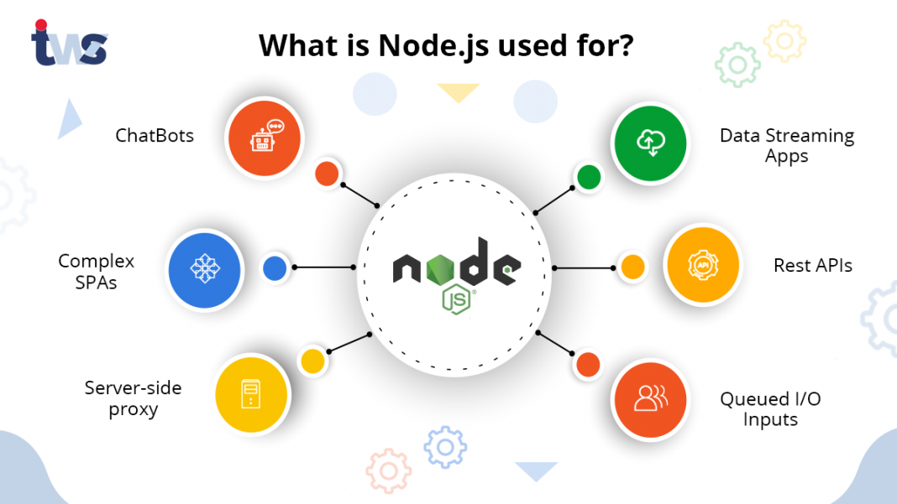

## NodeJS Server Application - Some Examples
##### last update: 8/10/21 dbe

  

## Background
Node.js is an exciting new platform for developing web applications, application servers, any sort of network server or client, and general-purpose programming. It is designed for extreme scalability in networked applications through an ingenious combination of server-side JavaScript, asynchronous I/O, and asynchronous programming.

While only ten years old, Node.js has quickly grown in prominence and is now playing a significant role. Companies, both large and small, are using it for large-scale and small-scale projects. *PayPal*, [for example](https://medium.com/paypal-tech/node-js-at-paypal-4e2d1d08ce4f), has converted many services from Java to Node.js. Other large Node.js adopters include *Walmart's* online e-commerce platform, *LinkedIn*, and e*Bay*.

At its heart, it is a standalone JavaScript engine ([Google's V8 JavaScript](https://v8.dev/) engine for Chrome), with extensions that is suitable for general-purpose programming and that has a clear focus on application server development. Node.js is not an application- server, but a programming runtime akin to Python, Go, or Java SE. While there are web application frameworks and application servers written in Node.js, it is simply a system to execute JavaScript programs.

To simplify the situation, the Node.js community has several (web) application frameworks, such as Express, providing the higher-level interfaces required by typical programmers. You can quickly configure an HTTP server with baked-in capabilities, such as sessions, cookies, serving static files, and logging, letting developers focus on their business logic. 

See [NodeJS.org](https://nodejs.org/en/) for more documentation and resources. [W3School](https://www.w3schools.com/nodejs/) for tutorials and programming examples. [NPM](https://www.npmjs.com/) for the *Node Package Manager* (NPM) and the nodejs paackage repository. And finally [Github](https://github.com/nodejs/community-committee) for the Node JS Community Committee.


---
### Some NodeJS Application Examples
* **cmd-wget.cjs**  
NodeJS script to simulate the well known CURL WGET command
```
node wget.cjs http://example.com
```  

* **demo-app1.js** / **demo-app2.js**  
NodeJS HTTP Server in its simplest form. App1 is returning a simple "Hello World" content in plain text, whereas App2 is responding by a HTML string
```
node demo-app1.js
node demo-app2.js
```  

* **demo-server1.js** / **demo-server2.js**  
Example NodeJS server, requesting (server side) Operating System Informations. Server2 is extended by a httpsniffer feature
```
node demo-server1.js
node demo-server2.js
```  

* **demo-encode1.js** / **demo-encode2.js**  
Example NodeJS server to demonstrate a simple encryption service which can be requested over the internet
```
node demo-encode1.js
node demo-encode2.js
```  


### More information and examples
* [Node.js Web Development - Fifth Edition (packt.com)](https://www.packtpub.com/product/node-js-web-development-fifth-edition/9781838987572)  
* [Best NodeJS Application Examples](https://www.futuremind.com/blog/best-nodejs-applications-examples)  
* [Types on NodeJS Applications](https://os-system.com/blog/12-types-of-node-js-applications-with-examples/)  
* [NodeJS Managed Runtime](https://docs.aws.amazon.com/apprunner/latest/dg/service-source-code-nodejs.html) on AWS App Runner
